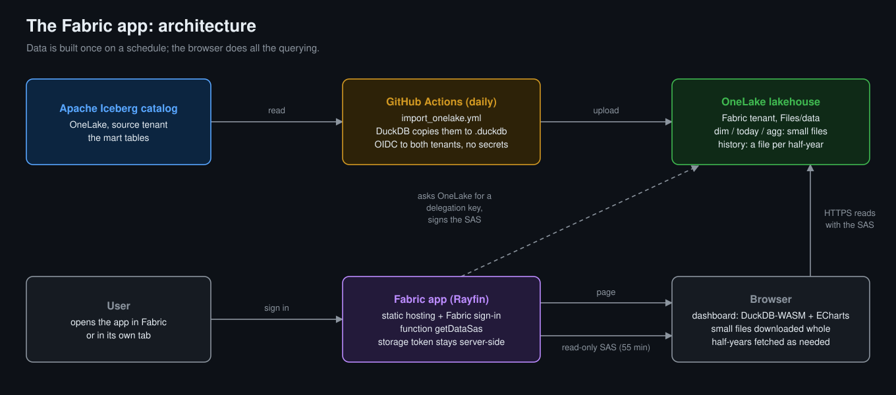

# Analytics as Code — the details

> None of the individual pieces here are new — dbt, DuckDB, Iceberg, GitHub Actions have all existed for years. What makes this kind of project possible now is that AI has made the cost of writing and maintaining code dramatically cheaper. Ideally, code like this can be deployed to any data platform — the platform's job becomes hosting, security, and isolation, while the logic stays portable in Git.

The entire analytics stack — ingestion, transformation, storage, and visualization — defined and deployed from a single Git repository. No servers to manage, no orchestrator to maintain. The only persistent layer is an **Iceberg REST catalog** (currently OneLake, a Microsoft Fabric lakehouse), which also holds the raw CSV archive.

## Architecture

| Source Data | → | dbt-duckdb | → | Iceberg Catalog | → | Semantic model | → | Clients |
|:-----------:|---|:----------:|---|:---------------:|---|:------:|---|:---------:|
| *external*  |   | *ephemeral, in-memory* | | *persistent, only state* | | *one Power BI `model.bim`: tables, relationships, measures* | | *one page on three hosts, two on DuckDB-WASM and one on the model itself, and a Power BI report* |

- **dbt-duckdb** — transformation engine that runs entirely in-memory. No database server, no cluster. A Python model handles data ingestion; SQL models handle transformation.
- **Iceberg REST catalog** — the single persistent layer. All warehouse state lives here as Iceberg tables, and the gzipped source CSVs are archived next to them in object storage, so nothing depends on the ephemeral CI runner's disk.
- **GitHub Actions** — orchestrates everything. Scheduled workflows replace traditional schedulers (Airflow, Dagster, etc.).
- **One semantic model** — a Power BI model (`semantic_model/model.bim`) over the Iceberg tables: what a table is, how tables relate, and every measure, in DAX. Every client reads the data through it.
- **Four clients** — a static HTML page that queries a cached copy of the tables in the browser (DuckDB-WASM, no backend API), deployed to GitHub Pages (public) and as a Microsoft Fabric app (sign-in, data in a lakehouse); the same page as a second Fabric app, with no copy and no engine in the browser: its DAX is run by the deployed model (VertiPaq); and a Power BI report on the same model in Direct Lake. See [Four Clients](#four-clients).

## Design Principles

- **Everything is code.** Models, tests, macros, pipelines, dashboard — all versioned in Git.
- **No running infrastructure.** dbt runs ephemerally in CI. The catalog is the only thing that persists.
- **File-based incremental processing.** Fact models track which source files have been processed, reading the work list from the ingestion log table. No watermark tables, no external state database.
- **Durable archive, no reconciliation code.** The CSV archive and its log live in object storage, not on the runner, so an interrupted run leaves nothing to repair — the next pass simply sees what is already there.
- **CI validates SQL on every code change.** `dbt build --target ci` runs all models + tests in-memory — catches broken SQL before it reaches production.
- **Loading skips tests.** The 30-min processing cadence is too frequent for expensive test runs against live tables, so `process_data` only runs `dbt run`.
- **Tests run daily.** Once every 24 hours, `dbt test --target prod` runs the complete suite against live Iceberg tables — uniqueness, not_null, accepted_values, and file completeness checks.
- **Tables are maintained daily.** The same workflow compacts each table's small data files and then expires snapshots older than a day, so a 30-minute commit cadence doesn't leave the tables fragmented and their metadata unbounded.

## Grain Reduction

Source data arrives at 5-minute resolution (rooftop solar every half hour). The raw Iceberg tables store everything at the grain it arrives in — no data is lost. What the clients read is a second set of tables built from them (`mart`): one row per unit and 5 minutes with its price on it, and the aggregates, per day and per hour of day by month. To give a sense of scale: ~1 billion raw records, ~300 million rows in the largest raw table, ~13 million 5-minute rows in one half-year dashboard file.

- **In dbt:** every table a chart reads is a dbt model, the aggregates included. Rooftop solar is stored half-hourly, as published; the 5-minute values a chart draws are worked out when it asks.
- **At import time:** `scripts/cache_catalog.py` copies those tables as they are into DuckDB files for the browser, with no rule of its own. It only decides the split: the 5-minute history as one file per half-year (each under GitHub's 100 MB per-file limit), the last 14 days as a small file refreshed every 30 minutes, the aggregates in one file.
- **At query time:** The dashboard adapts granularity to the selected date range: 5-minute resolution up to 30 days (downloading only the half-years the range touches, and none for the default last 3 days), daily and hour-of-day aggregates beyond. This keeps queries fast in single-threaded DuckDB-WASM.
- **Dashboard CSV download uses one consistent grain** — when users export data from the dashboard, it always uses a single time resolution, no mixing.

## How It Works

1. **Ingest** — A dbt Python model downloads source data and archives it as gzipped CSVs in the lakehouse's `Files/`, alongside a durable log of what has been fetched
2. **Transform** — dbt SQL models read those archived CSVs, apply transformations, and write incrementally to Iceberg tables as insert-only merges (one append snapshot per commit)
3. **Model** — more dbt SQL models turn the raw tables into the ones a reader wants (`mart`), and one semantic model describes those: relationships and measures
4. **Cache** — A script copies the `mart` tables from the Iceberg catalog into DuckDB files, as they are
5. **Visualize** — The page loads DuckDB-WASM, fetches the files and asks its questions in DAX, which a small compiler turns into SQL; Power BI reads the same tables through the same model, with no copy (Direct Lake)

## Four Clients

One semantic model (`semantic_model/model.bim`), four clients under `dashboard/`:

- `github/` and `fabric_app_wasm/` are one page (`dashboard/github/index.html`) on two hosts. A
  host only decides where the data files live and how the browser gets them
  (`storage/data.js`), so a chart is written once and reaches both.
- `fabric_app_vertipaq/` is that page again, as a Fabric app next to the deployed model. It
  has no data files, no DuckDB and no compiler: the DAX the page writes is sent to the model
  as it is, and Power BI runs it (VertiPaq, in Direct Lake over the Iceberg tables). It is
  the check that the page's DAX is DAX. The Analyze tab, which is SQL, is not in it.
- `powerbi/` is a Power BI report (`nem.Report`, as JSON) on the model as deployed to Fabric,
  which reads the Iceberg tables in Direct Lake. `deploy_model.yml` publishes the two together.

A measure is written once, in the model, and reaches all four.

| | GitHub Pages | Fabric app, DuckDB-WASM | Fabric app, VertiPaq |
|---|---|---|---|
| Live at | [nemtracker.github.io](https://nemtracker.github.io/) | inside a Fabric workspace | inside the model's Fabric workspace |
| Who can open it | anyone | people the app is shared with, after Fabric sign-in | the same, and they need read access to the model |
| Engine | DuckDB-WASM, in the browser | DuckDB-WASM, in the browser | VertiPaq, in Power BI |
| Data files | next to the page | a lakehouse, under `Files/data` | none: the model reads the Iceberg tables |
| 5-minute history | one file per half-year (GitHub's 100 MB limit), downloaded | the same half-year files, downloaded as parallel range requests | in the model |
| Host code | `dashboard/github/storage/data.js` | `dashboard/fabric_app_wasm/site/storage/` | `dashboard/fabric_app_vertipaq/site/` |
| Deployed by | `build.yml` (page), `import_data.yml` (data) | `rayfin up` from `dashboard/fabric_app_wasm/` (page), `import_onelake.yml` (data) | `rayfin up` from `dashboard/fabric_app_vertipaq/` (page), `deploy_model.yml` (model) |

### The layers of the dashboard

The dashboard has the layers of a BI stack, each in its own file. The implementation is naive
on purpose: the point is the layers, not their maturity.

| Layer | Here | In a real product |
|---|---|---|
| Consumer | `dashboard/github/index.html` | the BI tool |
| Query language | DAX, written in the page | DAX, MDX, VizQL, Malloy, a metrics request |
| Semantic model | `semantic_model/model.bim`, a Tabular model in TMSL | a Tabular model (TMSL, TMDL), LookML, MetricFlow YAML |
| Compiler | `dashboard/github/semantic/compiler.js` | MetricFlow, Cube's schema compiler, Malloy's compiler, Looker's SQL generator, Power BI's formula engine, Tableau's VizQL |
| Engine | DuckDB-WASM | the warehouse, VertiPaq, Hyper |
| Storage | `dashboard/github/storage/` | the lakehouse or warehouse connection |

In the Fabric app on VertiPaq the right-hand column is the real thing: the same page sends
the same DAX to the deployed model, and Power BI's formula engine and VertiPaq stand where
`compiler.js` and DuckDB-WASM do here.

- **The semantic model** describes the tables, their relationships and the measures, each
  with a description. It is a real Power BI model (`model.bim`), the same file that is
  deployed to Fabric: it holds DAX only, and nothing in it is written for the page.
- **The compiler** turns it into DuckDB views, and turns the page's DAX queries
  into SQL over them. It is a toy, on purpose: this is the one layer with no open-source
  equivalent, and the file is there to show where it sits. It knows the constructs this
  page uses and nothing else.
- **The query language** is where the layers show. SQL asks for tables, while a semantic
  model offers tables that know how they relate; the page asks in DAX for `fct_summary[mw]`
  by `dim_duid[FuelSourceDescriptor]` and the compiler works out that the two have to be
  joined, and writes the SQL. Which grain to read is still the page's to say. The Analyze
  tab is the exception: it is SQL, written against the same views.

### The Fabric app

Built with [Rayfin](https://www.npmjs.com/package/@microsoft/rayfin-cli). Fabric hosts the
page and signs you in, and the page reads its data directly from OneLake: no backend to run,
no query service.




- **Hosting:** `rayfin up` deploys the page to Fabric static hosting.
- **Sign-in:** Fabric single sign-on. Inside the Fabric portal there is no extra login; in
  its own tab it is one click.
- **Data:** the browser reads the files from OneLake itself, with read-only access to that
  one folder for about an hour at a time. A small server function signs that access; the
  storage token never reaches the browser.
- **Refresh:** `import_onelake.yml` rebuilds the files from the Iceberg catalog daily and
  uploads them to the lakehouse.

## Project Structure

```
├── models/
│   ├── staging/          # Python ingestion model
│   ├── dimensions/       # Dimension tables (calendar, reference data)
│   └── marts/            # Incremental fact tables
├── macros/               # Iceberg compatibility overrides, helpers
├── scripts/              # The cache (Iceberg → DuckDB files), table maintenance, deploy
├── semantic_model/       # The one semantic model (model.bim): what every dashboard reads, and a Fabric item
├── dashboard/            # Its four clients
│   ├── github/           # The page, and a folder per layer: frontend/, semantic/ (the compiler), storage/ (the GitHub Pages host)
│   ├── fabric_app_wasm/     # The same page as a Fabric app on DuckDB-WASM: its host code, sign-in, and the Rayfin project
│   ├── fabric_app_vertipaq/ # The same page as a Fabric app on the deployed model: its DAX is run by Power BI
│   └── powerbi/          # A report over the deployed model
├── tests/                # dbt data tests
├── .github/workflows/    # CI/CD pipelines
├── dbt_project.yml
└── profiles.yml          # ci (in-memory) / dev / prod (Iceberg)
```

## Limitations

- **GitHub Pages limits: 100 MB per file, about 1 GB per site.** The first is why the history is split into half-year files; the second is the one that binds now (the data files are close to it) and constrains how much more history the dashboard can hold.
- **The deployed files are state too.** A daily import rebuilds the aggregates and only the latest two half-years; older half-year files are kept as deployed. A change to older data needs an import of every period (`all_periods=true`).
- **DuckDB-WASM runs single-threaded.** Its multi-threaded build can't load extensions such as ICU yet and can't share OPFS file handles with its threads, and it only gained ~1.4x on 4 threads when tried (2026-09-30). We use the native DuckDB file format (not Parquet) because DuckDB-WASM can query its own format efficiently even under this constraint — range requests, predicate pushdown, and columnar reads all work without needing to load the entire file into memory.
- **Limited by the browser.** A tab gets about 4 GB of memory; a query that needs more fails. Phones and old laptops will struggle.

The Fabric app is an experiment, with limits of its own:

- **Security is per table, not per row.** Only people the app is shared with in Fabric can sign in and read the data. For them there is no row-level or column-level security: if different users must see different rows or columns, use something else.
- **No public access.** Every visitor signs in with a Fabric account the app is shared with. As far as I can tell, it cannot be opened anonymously.
- **Only the item's owner can deploy to it.** An app deployed from a laptop cannot then be deployed from CI, or the reverse: each identity deploys the item it created.

## Setup

### Environment Variables

The catalog is the **OneLake Iceberg REST catalog** (a Microsoft Fabric lakehouse). In CI the
values come from GitHub repository **variables** (`WS_ID`, `LH_ID`, `AZURE_TENANT_ID`,
`AZURE_CLIENT_ID` — public identifiers, no secrets) plus a per-run token minted after an OIDC
federated `azure/login`:

| Variable | Description |
|----------|-------------|
| `ONELAKE_ENDPOINT` | `https://onelake.table.fabric.microsoft.com/iceberg` |
| `WAREHOUSE_PATH` | `{workspace_id}/{lakehouse_id}` |
| `ONELAKE_TOKEN` | Short-lived Azure storage token (minted per run, never stored) |
| `FILES_PATH` | `abfss://{workspace_id}@onelake.dfs.fabric.microsoft.com/{lakehouse_id}/Files` — where the CSV archive and its log live. Required off the `ci` target |
| `download_limit` | Files fetched per feed per run (default 2; the workflow uses 200) |
| `process_limit` | Files loaded per fact model per run (default 1000; the workflow uses 300) |
| `AZURE_TRANSPORT_OPTION_TYPE`, `CURL_CA_INFO` | `curl` and the CA bundle, on GitHub runners only |
| `GITHUB_TOKEN` | Optional: authenticated GitHub API calls for the backfill listings |
| `NEMTRACKER_TOKEN` | The one secret: pushes the dashboard to its GitHub Pages repo |

### Local Development

```bash
pip install -r requirements.txt

# Validate the models on plain DuckDB (no catalog needed). It runs the download
# for real: two files per feed, archived under /tmp.
dbt build --target ci --profiles-dir .
```

The `dev` target is not a sandbox: it attaches the same catalog as `prod` and writes the
same `landing` and `mart` tables. To use it against a lakehouse of your own (`az login` with
an identity that can access the Fabric workspace):

```bash
az login
export ONELAKE_ENDPOINT=https://onelake.table.fabric.microsoft.com/iceberg
export WAREHOUSE_PATH=<workspace-guid>/<lakehouse-guid>
export FILES_PATH=abfss://<workspace-guid>@onelake.dfs.fabric.microsoft.com/<lakehouse-guid>/Files
export ONELAKE_TOKEN=$(az account get-access-token --resource https://storage.azure.com/ --query accessToken -o tsv)
dbt build --target dev --profiles-dir .
```

### The Fabric App

You need a Fabric workspace with a lakehouse:

- Workspace settings → OneLake → turn on **Authenticate with OneLake user-delegated SAS tokens**
  (off by default; the tenant setting *Use short-lived user-delegated SAS tokens* is on by default).
- The owner of the Fabric app item must be able to read the lakehouse.

Everything else is Rayfin — see the
[Rayfin documentation](https://learn.microsoft.com/fabric/embedded/rayfin/overview):

```bash
cd dashboard/fabric_app_wasm
npm ci && npm ci --prefix rayfin/functions
npx rayfin login      # sign in to Fabric
npx rayfin up         # build + deploy to Fabric static hosting; prints the hosting URL

# once, after the first deploy: where the app's function signs read access
echo https://onelake.dfs.fabric.microsoft.com/<workspace>/<lakehouse>.Lakehouse/Files \
  | npx rayfin secret set ONELAKE_FILES_URL --stdin
```

Then run the **Import OneLake** workflow to fill the lakehouse (`LAKE_TENANT_ID`,
`LAKE_CLIENT_ID`: an Entra app with a federated credential for this repo and write access to
the workspace), and open the app in the Fabric portal or in its own tab.

`deploy_fabric.yml` runs the same deploy from CI with that Entra app, no secret, into an item
of its own, because only an item's owner can deploy to it. It is parked: functions do not
run yet on an item owned by a service principal (microsoft/rayfin#89), so the app is
deployed from a laptop.
