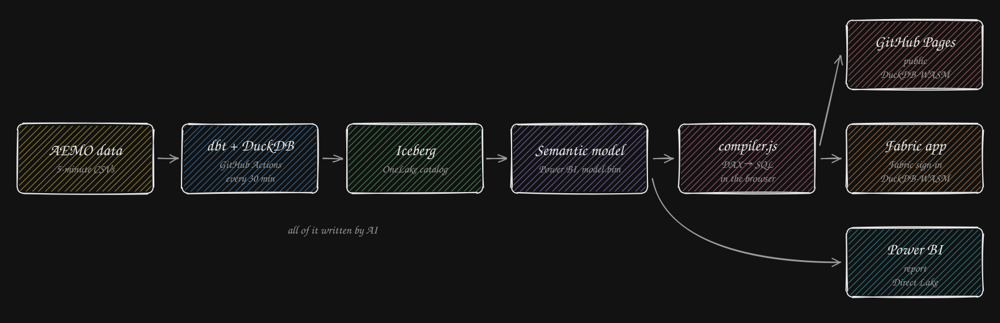

# Analytics as Code

An example of AI-driven analytics: every line here — ingestion, models, tests, pipelines,
semantic model, dashboards — was written by AI. The data is the Australian electricity
market (AEMO).

- **dbt + DuckDB** on GitHub Actions load the data into **Iceberg** tables, every 30 minutes.
- **One Power BI semantic model** ([`semantic_model/`](semantic_model/)) describes those
  tables: their relationships and the measures, in DAX.
- **Three clients** read it ([`dashboard/`](dashboard/)):
  - **GitHub Pages** ([live](https://nemtracker.github.io/), public) and a **Microsoft
    Fabric app** (Fabric sign-in): the same page. No server: the browser runs the queries
    itself (DuckDB-WASM) on a cached copy of the tables.
  - a **Power BI report**, on the same model in Direct Lake.
- **[`compiler.js`](dashboard/github/semantic/compiler.js)** is what lets the page read a
  Power BI model without Power BI: it turns the model into DuckDB views and the page's DAX
  queries into SQL. **It is not a general-purpose DAX compiler.** It was written for this
  repository only: it knows this model and the constructs this page uses, and fails on
  anything else. It is here to show where that layer sits, the one with no open-source
  equivalent.

Details: [ARCHITECTURE.md](ARCHITECTURE.md)
