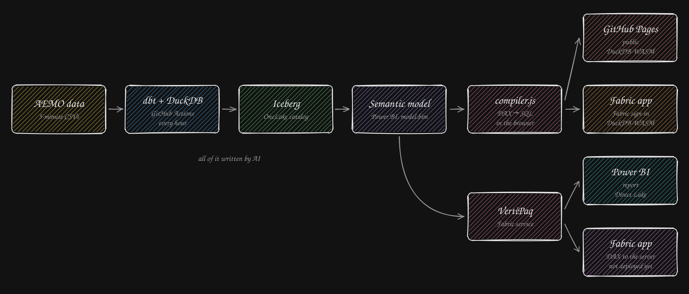

# Analytics as Code

An example of AI-driven analytics: every line here — ingestion, models, tests, pipelines,
semantic model, dashboards — was written by AI. The data is the Australian electricity
market (AEMO).

- **dbt + DuckDB** on GitHub Actions load the data into **Iceberg** tables, every hour.
- **One Power BI semantic model** ([`semantic_model/`](semantic_model/)) describes those
  tables: their relationships and the measures, in DAX.
- **Its clients** ([`dashboard/`](dashboard/)):
  - **GitHub Pages** ([live](https://nemtracker.github.io/), public,
    [`dashboard/github/`](dashboard/github/)) and a **Microsoft Fabric app** (Fabric
    sign-in, [`dashboard/fabric_app/wasm/`](dashboard/fabric_app/wasm/)): the same page. No
    server: the browser runs the queries itself (DuckDB-WASM) on a cached copy of the tables.
  - a **Power BI report** ([`dashboard/powerbi_report/`](dashboard/powerbi_report/)), on
    the same model, run by VertiPaq over the Iceberg tables (Direct Lake).
  - a second backend of the Fabric app, the page with VertiPaq as its engine and no copy of
    the data ([`dashboard/fabric_app/vertipaq/`](dashboard/fabric_app/vertipaq/)),
    installed with the whole stack (lakehouse, dbt notebook and pipeline, model, report)
    into one Fabric workspace by `deploy_fabric.yml`.
- **One page, two ways of asking** ([`dashboard/github/`](dashboard/github/)): `common/` is
  the page (the charts, the data files, the Logs tab), and only what it asks with differs.
  - [`dax/`](dashboard/github/dax/) asks the semantic model: a chart names the model's
    columns and measures, and [`compiler.js`](dashboard/github/dax/semantic/compiler.js)
    writes that as DAX, and the DAX as SQL. Served at
    [nemtracker.github.io](https://nemtracker.github.io/).
  - [`sql/`](dashboard/github/sql/) asks DuckDB in plain SQL, with no semantic model: each
    figure is written out where a chart uses it, as a team would build the page in
    practice. Served at [nemtracker.github.io/sql](https://nemtracker.github.io/sql/). Its
    rows are checked against the DAX page's, question by question.
- **The compiler** is what lets the page read a Power BI model without Power BI: it turns
  the model's relationships into DuckDB views and the page's queries into DAX, then SQL.
  **It is not a general-purpose DAX compiler.** It was written for this repository only: it
  knows this model and the constructs this page uses, and fails on anything else. It is
  here to show where that layer sits.
- **[`packages/dax-sql`](packages/dax-sql/)** is the general-purpose one: any Tabular model,
  DAX's filter context, context transition and relationships, compiled to SQL (tested on
  DuckDB). The page does not use it; its queries are part of its tests.

Details: [doc/ARCHITECTURE.md](doc/ARCHITECTURE.md)
